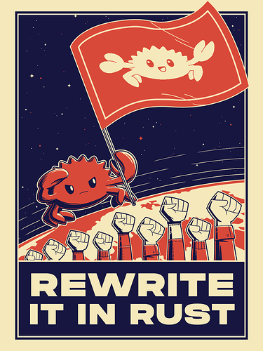

  
  

Stuttgart🇩🇪

## 🛠 Skills

  
  
  
  
  
  
  

<!---
FlorianSpengler/FlorianSpengler is a ✨ special ✨ repository because its `README.md` (this file) appears on your GitHub profile.
You can click the Preview link to take a look at your changes.
--->
